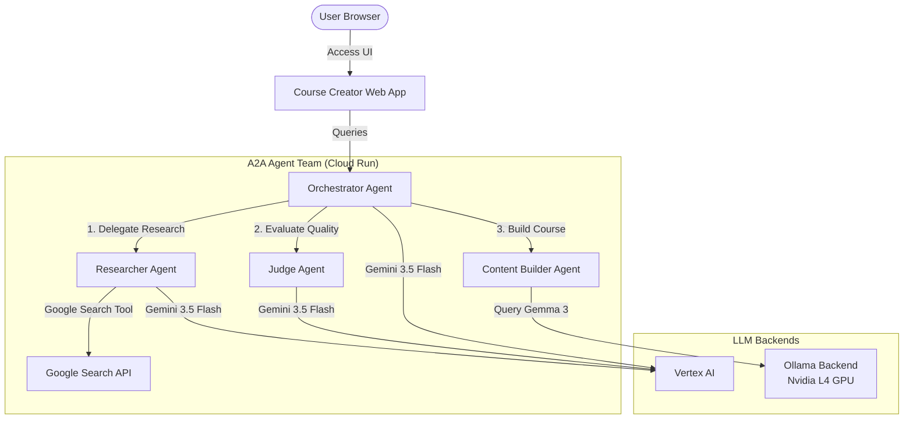

# Multi-Agent Course Creator with Self-Hosted LLM on GPU

A premium, decentralized team of autonomous AI agents designed to research, judge, and generate educational course content. This project is built using Google's **Agent Development Kit (ADK)** and the **Agent-to-Agent (A2A)** protocol, deployed as a microservices architecture on **Google Cloud Run**.

The system demonstrates a hybrid model: using commercial Gemini models for orchestrating, researching, and judging, alongside a **self-hosted Gemma model** running on **Cloud Run with an NVIDIA L4 GPU** via Ollama for final content building.

---

## Architecture Diagram

The system comprises **6 specialized microservices**:



### Microservices Description

*   **Course Creator Web App (`app`):** The public-facing frontend UI that allows users to input topics, trigger the creation flow, and view real-time results.
*   **Orchestrator Service (`orchestrator`):** The main workflow coordinator. It executes sequential tasks and feedback loops, orchestrating calls to individual agents.
*   **Researcher Service (`researcher`):** Scrapes and synthesizes web data. It uses the `google_search` tool and a Gemini model to compile information.
*   **Judge Service (`judge`):** A critic agent that evaluates the quality of the researched data against a structured rubric to ensure accuracy and completeness.
*   **Content Builder Service (`content_builder`):** The final generator agent. It receives the approved research and writes the course material using a self-hosted model.
*   **Ollama GPU Backend (`ollama-gemma-gpu`):** A high-performance inference server hosting the `gemma3:270m` (or `gemma3:12b`) model on NVIDIA L4 GPUs.

---

## Detailed Walkthrough of Recent Fixes

### 1. The Google Search Import Fix (`NameError`)
During container startup, the `researcher` service was failing with the following error:
```
NameError: Fail to load 'agent' module. name 'google_search' is not defined
```
*   **Cause:** In `agents/researcher/agent.py`, the `tools` list included the `google_search` reference, but the file lacked the import statement for it.
*   **Solution:** We imported the built-in search tool from the Google ADK tools library:
    ```python
    from google.adk.tools.google_search_tool import google_search
    ```

### 2. Gcloud Quota Project Authorization Loop
When running deployment commands, the active user encountered permission denied errors referencing `build-with-ai` (which lacked the project ID suffix):
```
Caller does not have required permission to use project build-with-ai.
```
*   **Cause:** The local `gcloud` configuration had an invalid `billing/quota_project` and `core/project` defined as the human-readable project name (`build-with-ai`) rather than its globally unique project ID (`build-with-ai-488112`). This caused all `gcloud` calls to append invalid billing headers.
*   **Solution:** We ran the following sequence to unset the incorrect configs, set the correct project ID, and bind the quota project for Application Default Credentials (ADC):
    ```bash
    gcloud config unset billing/quota_project
    gcloud config unset project
    gcloud config set project build-with-ai-488112
    gcloud auth application-default set-quota-project build-with-ai-488112
    ```

---

## Local Development Setup

To run the multi-agent system locally:

1.  **Sync Dependencies:**
    Make sure you have `uv` installed, then run:
    ```bash
    uv sync
    ```

2.  **Authenticate Application Default Credentials (ADC):**
    ```bash
    gcloud auth application-default login
    ```

3.  **Run Ollama Locally:**
    Download and launch Ollama, then pull the target Gemma model:
    ```bash
    ollama serve
    ollama pull gemma3:270m
    ```

4.  **Launch the Local Runner:**
    Start all microservices and the web UI locally:
    ```bash
    ./run_local.sh
    ```
    Then open `http://localhost:8000` in your web browser.

---

## Cloud Deployment

A single bash script handles the deployment of all six services to Cloud Run:

```bash
./deploy.sh
```

### Deployment Sequence:
1.  **Ollama GPU Backend:** Deployed first with NVIDIA L4 GPU capability. Once running, its public endpoint is captured.
2.  **Agent Microservices:** `researcher`, `content_builder` (injected with the Ollama API base URL), and `judge` are deployed.
3.  **Orchestrator:** Deployed with the A2A endpoint cards pointing to the active microservices.
4.  **Web App:** Deployed with public access, linking back to the orchestrator.
